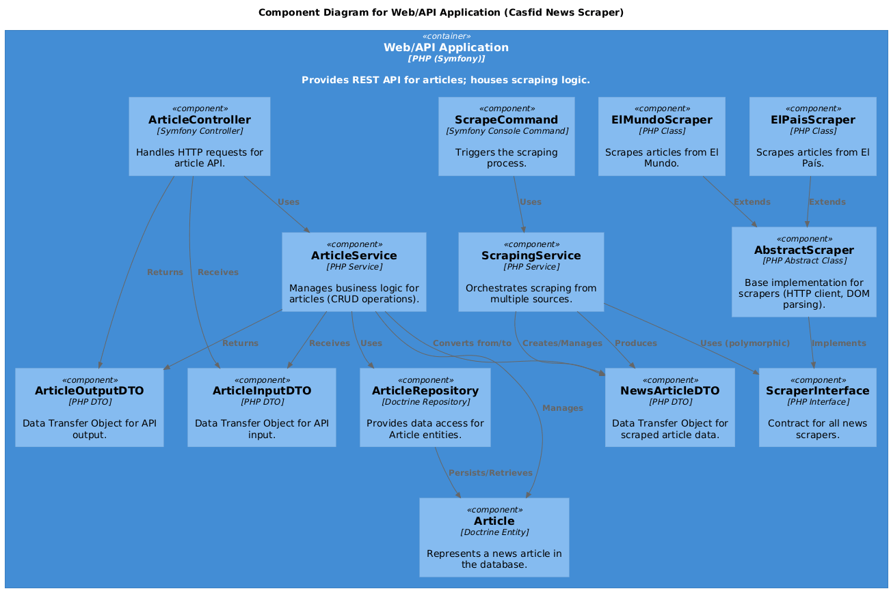

# El test

Me llevó demasiado tiempo reaprender la magia (validación, el manejo de errores con ExceptionSubscriber y demás magia) de Symfony, porque no trabajo con él desde hace años. Creo que hubiera sido mas representativo de mi conocimiento el manejo de los status codes y los errores de forma manual en el controlador, pero en el ejercicio se pedía un uso adecuado de Symfony.

Yo conozco PHP a fondo y Laravel, pero Symfony no tanto, por aclarar eso. También me hubiera gustado hacer mas tests unitarios y funcionales, pero esta semana he tenido bastante trabajo y no he tenido tiempo para más. Tampoco me dio tiempo a hacer la documentacion de la API con Swagger, pero si me dejais un poco mas de tiempo con gusto la haré. También me hubiera gustado configurar algun tiempo de espera para reintentos en el scrapper, por ejemplo, por si fallara, para aumentar su resiliencia.

## Los diagramas

Son los archivos c4\_\*.puml.



## Cómo ejecutar el scrapper

1.  **Guardará las noticias en la base de datos MYSQL. El DATABASE_URL tiene que estar propiamente configurado y luego correr las migraciones**:

    ```bash
    php bin/console doctrine:schema:update
    ```

2.  **Se corre con el siguiente comando**:
    ```bash
    php bin/console app:scrape-news
    ```

## Configuración de la base de datos para pruebas

Los tests funcionales requieren una base de datos de pruebas dedicada con el esquema correcto.

1.  **Cree la base de datos de pruebas**:

    ```bash
    php bin/console doctrine:database:create --env=test
    ```

2.  **Actualice el esquema de la base de datos de pruebas**:

    ```bash
    php bin/console doctrine:schema:update --force --env=test
    ```

## Ejecución de los tests

Una vez que el entorno y la base de datos estén configurados, puede ejecutar los tests usando PHPUnit:

```bash
vendor/bin/phpunit
```
